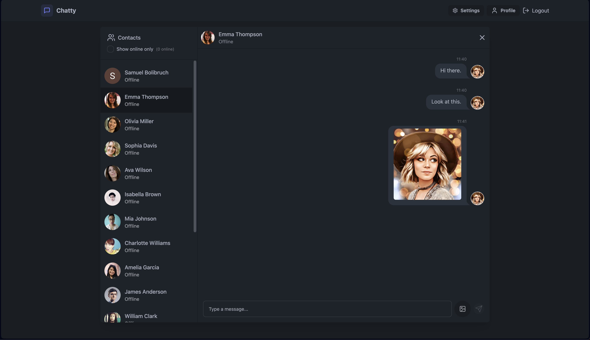
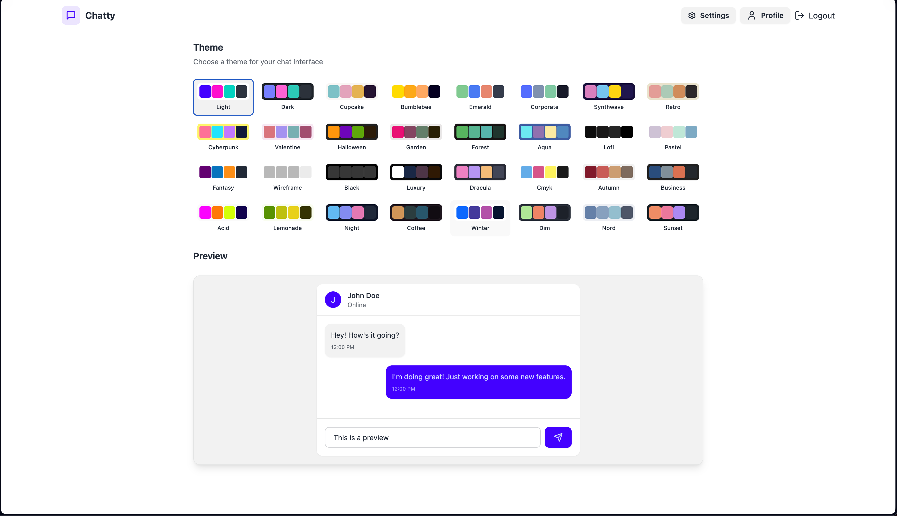
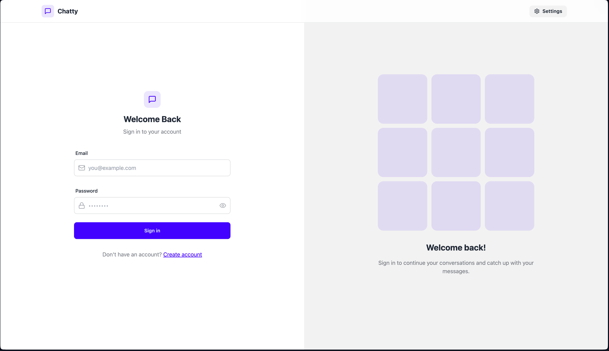

# Real-time Chat Application

This is a **real-time chat application** built using the MERN stack, enhanced with Socket.io for real-time messaging and TailwindCSS for styling.

## Features
- **User Authentication & Authorization**: Secure sign-up and login using JWT tokens.  
- **Real-Time Messaging**: Instant communication between users powered by Socket.io.  
- **Online User Status**: Displays the current online status of users.  
- **Global State Management**: Zustand is used for efficient client-side state management.  
- **Error Handling**: Comprehensive error management on both the server and client sides.  
- **Responsive Design**: Styled with TailwindCSS and Daisy UI for a modern and mobile-friendly interface.  
- **Pre-Built Components and Themes**: DaisyUI provides pre-designed components with customizable themes and color schemes for the application. 

## Screenshots
### Login Page

### Chat Page

### Theme Selection

## Technologies Used

### Backend
- **Node.js**: Server-side runtime environment.  
- **Express**: Fast and minimalist web framework for Node.js.  
- **MongoDB**: NoSQL database for storing user data and messages.  
- **Mongoose**: Object Data Modeling (ODM) library for MongoDB.  
- **Socket.io**: Enables real-time, bidirectional communication between client and server.  
- **jsonwebtoken**: For generating and verifying JWT tokens.  
- **bcryptjs**: For secure password hashing.  

### Frontend
- **React**: JavaScript library for building user interfaces.  
- **React Router**: For navigation and routing between pages.  
- **Zustand**: Lightweight state management library.  
- **Axios**: For making HTTP requests.  
- **React Hot Toast**: For beautiful and customizable toast notifications.  
- **TailwindCSS & Daisy UI**: For responsive and modern styling, with pre-built components and customizable themes.  

## How to Use
1. Open the application at [https://mern-chat-app-jku9.onrender.com](https://mern-chat-app-jku9.onrender.com).  
2. Sign up or log in to your account.  
3. Start chatting in real-time with other users.  
4. Enjoy features like real-time updates, online user status, and theme customization.  

## Deployment
The application is deployed on **Render**, ensuring free and seamless access.

---
